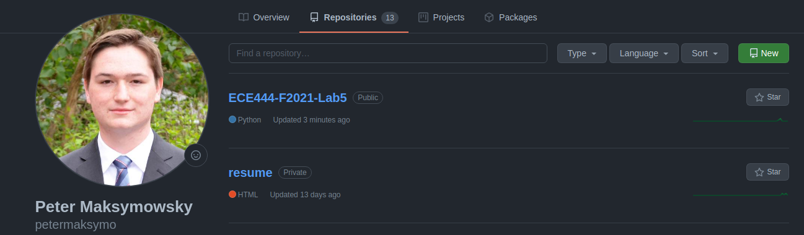

# Peter Maksymowsky

Note: this repo is a clone of [https://github.com/nelaturuk/education_pathways](https://github.com/nelaturuk/education_pathways.)

## Activity 1:

Screenshot of repo in my github account:

## Activity 2-5:
Screenshot of my Home Page:

Screenshot of my Results Page Form:

Screenshot of my Results Page Results Table:

## Activity 6:
The biggest improvement/change in my opinion is the results table. My stakeholder interviews found it hard to differentiate between the different columns and by now adding borders and a nice header, it is much more usable. There is also a little bit of padding added so the text doesn't go right against the boundaries which helps even more in clarity.

---
# CARTE Education Pathways

## Description
Welcome to CARTE's in-development tool for course selection at UofT. Education Pathways allows for more intelligent course searching, by matching not just the terms you search, but ones relevant to them. The more terms you search for, the more relevant your results will be! Even try searching across disciplines for the courses that best cover each.

Whatever year you are looking for, Education Pathways will also suggest courses in earlier years that will best help you to prepare. To get the most out of this, try searching for courses in a later year and see what is suggested for your current one.

We are looking for feedback to improve Education Pathways and make it more useful for students. If you have ideas or suggestions, please email us!

## Setup Instructions

### With Docker

## Repository files:

`./Procfile ./wsgi.py` *tells gunicorn how to run the program*

`./environment.yml  ./requirements.txt` *specifies python requirements for anaconda and pip respectively*

`./__init__.py` *main flask code*

`./readme.md` *this file*

`./resources:` *contains datasets used in the program*

`course_vectorizer.pickle df_processed.pickle`

`course_vectors.npz       graph.pickle`

`./static:` *contains any static elements of the webpage, in this case just the CARTE logo*
`CARTE_logo.jpg`

`./templates:` *contains flask templates for rendering HTML*

`_formhelpers.html course.html       index.html        results.html`
